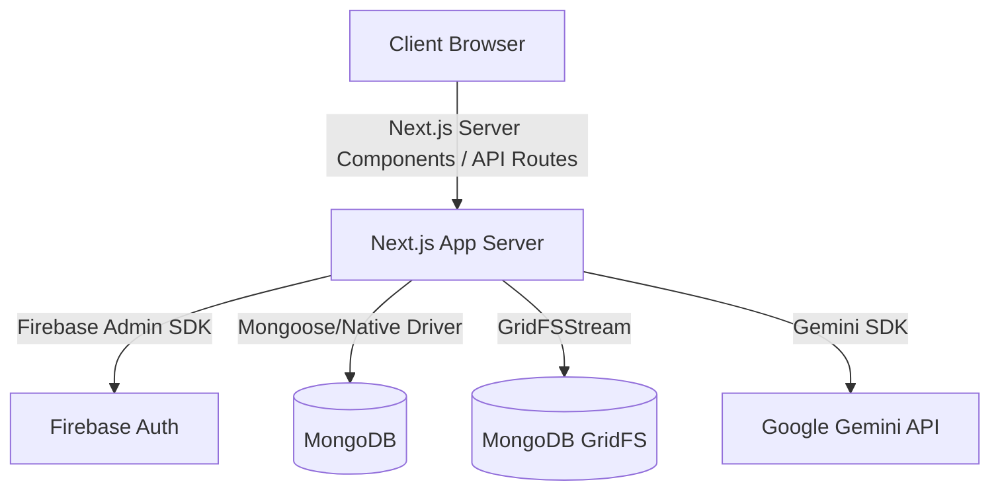

# MyGOV Agent 2.0

MyGOV Agent 2.0 is a GovTech case-management app built in a single Next.js App Router repo. It runs in one live mode only: Firebase Auth for identity, MongoDB for application data, MongoDB GridFS for uploaded files, and Gemini for server-side AI assistance.

## Hackathon Alignment

- Hackathon: `PROJECT 2030: MyAI Future Hackathon`
- Selected track: `Track 2 - Citizens First (GovTech & Digital Services)`
- Core challenge addressed: reducing bureaucratic friction in citizen service delivery, case intake, document verification, and follow-up communication
- Malaysia relevance: the project focuses on end-to-end digital public-service workflows, clearer status visibility, and document-driven case handling that fits real local government service needs including complaints, reminders, renewals, and flood-related aid workflows
- Build With AI position: Gemini is used as a live server-side intelligence layer for case-aware guidance, summaries, document-context help, and next-step support for both citizens and admins

## Problem

Many public-service flows still create friction for citizens and staff:

- citizens are often unsure where to start, what documents are needed, and what happens next
- manual case handling leads to repeated questions, delayed reviews, and poor status visibility
- document-heavy service requests can become especially stressful during time-sensitive situations such as flood-related support cases
- admins need a clearer triage and review workspace to move cases forward without losing context

MyGOV Agent 2.0 is designed to reduce that friction with one shared live case record across citizen and admin experiences.

## Solution

MyGOV Agent 2.0 provides:

- a guided citizen case-submission flow
- live evidence upload and review tracking
- citizen dashboards that make the next step clear
- an admin operations dashboard and review workspace for queue-based triage
- server-side Gemini assistance grounded in live case, file, and workflow context

The product goal is simple: help citizens submit and follow a case with confidence while giving public-service teams a clearer way to review, request documents, and decide next actions.

Hero flow:

`citizen login -> dashboard -> upload evidence -> create/open case -> AI help -> admin review -> status update -> citizen sees live change`

## Live App

Live hosting link: https://mygov-agent-2-0-526785154511.asia-southeast1.run.app/

### Test Accounts

Use the following test accounts to explore both sides of the platform:

Citizen portal:
- Email: `nazmulhasandh@gmail.com`
- Password: `nazmulhasandh@gmail.com1`

Admin console:
- Email: `first.admin@mygov.local`
- Password: `Admin12345!`

## Technical Documentation

### Tech Stack

- **Framework:** Next.js App Router
- **Language:** TypeScript
- **Styling:** Tailwind CSS and Lucide Icons
- **Authentication:** Firebase Auth with server-side verification via Firebase Admin
- **Database:** MongoDB
- **File Storage:** MongoDB GridFS
- **AI:** Google Gemini (Server-side only)
- **Maps:** Leaflet and OpenStreetMap
- **Validation:** Zod

### System Architecture

The application follows a monolithic architecture built on top of Next.js App Router, combining both frontend UI and backend API routes in a single repository.



#### Runtime Architecture

- `src/app/api/*`: Route handlers
- `src/lib/auth/*`: Session and identity helpers
- `src/lib/config/*`: Environment checks
- `src/lib/security/*`: Errors and authorization helpers
- `src/lib/repositories/*`: MongoDB data access layer
- `src/lib/services/*`: Core business logic
- `src/lib/storage/gridfs.ts`: GridFS upload, delete, and download helpers
- `src/lib/ai/*`: Gemini prompts, context assembly, and model calls
- `src/lib/audit/*`: Audit logging helpers
- `src/lib/validation/*`: Zod schemas for input validation
- `src/types/*`: Typed document models and API interfaces

There is no separate Express backend, no Firestore dependency, no Firebase Storage dependency in the upload flow, and no runtime demo or prototype mode. Everything runs through the Next.js API layer.

### Database Models

- **Users Collection:** Extends Firebase identities with application-specific roles (`citizen`, `admin`) and profile data.
- **Cases Collection:** Core entity tracking submissions, statuses (`open`, `under_review`, `action_required`, `closed`), and metadata.
- **Case Events Collection:** Append-only log of all actions taken on a case for full audit trails.
- **Files (GridFS):** Binary file chunks and metadata for evidence uploads.

### AI Layer & Workflows (Gemini)

This project is not using AI as a decorative chatbot. Gemini is deeply integrated into the core service workflow to provide context-aware intelligence.

- **Citizen Assistance:** Citizens can query what to do next, what documents are needed, and how to interpret their case status. The AI guides them based on the specific requirements of their case type.
- **Admin Support:** Admins receive case-aware support while reviewing files. Gemini summarizes cases, highlights missing documents, and suggests next actions or responses.
- **Context Grounding:** Prompts are dynamically built from live case summaries, evidence state, workflow history, and missing-document context.
- **Implementation:** Gemini operates purely server-side. Assistant failures return explicit unavailable errors instead of simulated or hallucinated replies. This repository currently focuses on Gemini-based intelligence; it does not yet include Vertex AI Search or Firebase Genkit orchestration.

### Authentication & Authorization

#### Role Model

Supported roles:
- `citizen`
- `admin`

Rules:
- Public registration always creates a `citizen`.
- Admins cannot self-register publicly.
- Citizen routes redirect/resolve to `/dashboard`.
- Admin routes redirect/resolve to `/admin`.
- Role is resolved exclusively from MongoDB user records, not client-selected state.
- Role changes are strictly admin-only and are logged to `role_audit_logs`.
- Self-demotion and removal of the last admin are blocked by the backend.

#### Data Boundaries

- **Firebase Auth:** Handles client sign-in, registration, and password reset workflows.
- **Firebase Admin:** Used server-side to verify ID tokens and manage secure, HTTP-only session cookies.
- **MongoDB:** Source of truth for users, cases, case events, file metadata, notifications, reminders, chat, admin notes, and role audit logs.
- **MongoDB GridFS:** Stores all uploaded evidence blobs securely.
- **Gemini:** Provides live server-side assistant responses based only on verified database state.

If MongoDB, GridFS, Firebase Admin, or Gemini are unavailable, the app returns explicit failure states rather than gracefully degrading to fake content.

### Current Backend Capabilities

#### Auth
- Firebase ID token exchange via `/api/auth/login`.
- Server-issued, HTTP-only session cookie generation for protected routes.
- MongoDB-backed application user resolution using `firebaseUid`.
- Middleware-enforced citizen/admin protected routing.

#### Cases And Timeline
- Citizen case creation and own-case reads.
- Admin queue reads and detailed case reviews.
- Admin case state mutations.
- Automatic `case_events` generation for creations, uploads, status changes, document requests, and review actions.

#### Files
- Uploads flow securely through `POST /api/uploads`.
- Binary blobs are chunked and stored in GridFS.
- Corresponding file metadata is indexed in MongoDB.
- Secure file streaming via `GET /api/files/[id]`.
- Admin file reviews update the review status and append notes to the MongoDB metadata.

### Route Overview

#### Public Routes
- `/`
- `/login`
- `/register`
- `/forgot-password`

#### Citizen Routes
- `/dashboard`
- `/cases/new`
- `/cases/[id]`
- `/notifications`
- `/profile`

#### Admin Routes
- `/admin`
- `/admin/cases/[id]`
- `/admin/users`

#### Backend API Routes
- `/api/auth/login`
- `/api/auth/register`
- `/api/auth/logout`
- `/api/cases`
- `/api/cases/[id]`
- `/api/cases/[id]/evidence`
- `/api/uploads`
- `/api/files/[id]`
- `/api/admin/cases/[id]/actions`
- `/api/admin/cases/[id]/files`
- `/api/admin/users/[id]/role`
- `/api/assistant/messages`
- `/api/users`
- `/api/notifications`
- `/api/profile`
- `/api/health`

### Security Notes

- Firebase Admin SDK operations are strictly confined to the server.
- Gemini API keys are never exposed to the client.
- All API route handlers rigorously validate incoming payloads using Zod schemas.
- Protected API routes and Server Actions verify session validity and RBAC before processing mutations.
- File blobs are stored centrally in GridFS, separate from normal MongoDB collections.
- All sensitive actions, particularly role changes, are tracked with audit logs.

## GovTech Impact

This project is aimed at practical public-service outcomes:

- clearer citizen intake reduces incomplete submissions
- file review and missing-document handling reduce manual follow-up loops
- live dashboards improve status transparency for both sides
- admin queue and review flows improve triage speed and decision clarity
- a shared record of cases, files, notes, reminders, and events supports more accountable digital service delivery

Potential real-world value:

- better accessibility for citizens who need digital-first government support
- lower case-handling friction for document-driven service workflows
- improved response coordination for recurring public-service issues and crisis-related requests
- stronger trust through honest live status, file review state, and clear next-step guidance

## Environment Variables

Use `.env.local` for local development. Never commit real values.

Required app vars:

- `NEXT_PUBLIC_APP_URL`
- `MONGODB_URI`
- `MONGODB_DB_NAME`
- `GRIDFS_BUCKET_NAME`
- `GEMINI_API_KEY`
- `GEMINI_MODEL`
- `SESSION_COOKIE_NAME`

Firebase client auth vars:

- `NEXT_PUBLIC_FIREBASE_API_KEY`
- `NEXT_PUBLIC_FIREBASE_AUTH_DOMAIN`
- `NEXT_PUBLIC_FIREBASE_PROJECT_ID`
- `NEXT_PUBLIC_FIREBASE_MESSAGING_SENDER_ID`
- `NEXT_PUBLIC_FIREBASE_APP_ID`

Firebase admin verification vars:

- `FIREBASE_PROJECT_ID`
- `FIREBASE_CLIENT_EMAIL`
- `FIREBASE_PRIVATE_KEY`

## Local Setup

```bash
npm install
npm run dev
```

Validation:

```bash
npm run lint
npm run typecheck
npm run build
```

Optional admin bootstrap:

```bash
npm run seed:admin -- --email admin@example.com --password "StrongPass123!" --name "First Admin"
```

## AI Tooling Disclosure

AI-assisted development tools were used during the hackathon workflow for implementation support and iteration. The team remains responsible for the full codebase and should be able to explain the architecture, flows, and implementation decisions during judging.

## Attribution

- Next.js
- Firebase Auth
- MongoDB
- Gemini
- Leaflet
- OpenStreetMap

## License

No license file is included yet. Add one before public redistribution if your submission requires it.
